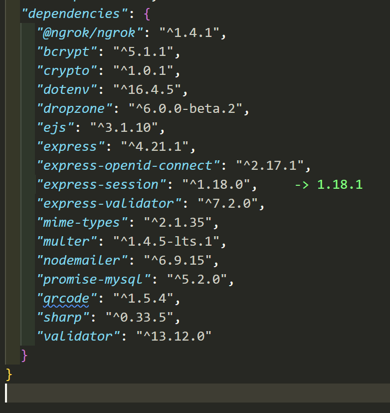

# Title

## Introduction

Move out application is a tool to help users organize their move with features like having dashboard after registering and being verified so they can log in and start using the app so that their data persist saved when they log in again. As well users can create boxes with labels so they store their stuff in boxes that have labels with QR codes and categories. So super organized, customable and user friendly. 

The main purpose behind the project is to provide a whole functional system that helps the users while moving from apartment to another with their stuff, making it a focused and efficient tool for this scenario. However, it's not only for moving to another house or apartment, while the system can be useful for traveling or whatever organizing and categorizing stuff perhaps be adapted for other types of moves in the future, like office relocations or storage organization...

In public/feature-screenshots there are screenshots clarifying the main application's features and guide.

#### Technologies & Runtime:

Node.js:

JavaScript runtime environment
Used for server-side execution
Enables asynchronous, event-driven programming.

Express.js:

Web application framework for Node.js
Handles routing and middleware
Manages HTTP requests/responses
Provides robust API features.

EJS (Embedded JavaScript) Template engine:

Allows embedding JavaScript in HTML
Server-side rendering of dynamic content
Used for generating dynamic HTML pages.

Database Layer:

MySQL as the DBMS (Database Management System)
MariaDB CLI for database management and queries
SQL for data manipulation and queries.

Architectural Patterns:

MVC (Model-View-Controller):

Models: Database interactions and business logic.
Views: EJS templates for presentation.
Controllers: Route handlers and application logic.

Middleware Pattern:

Authentication middleware.
Session management.
Request parsing.
Static file serving.

RESTful Architecture:

Resource-based routing.
HTTP methods for CRUD operations.
Stateless request handling.

Additional Important Technologies:

Authentication & Security:

Auth0 integration.
Session management.
PIN-based authentication.

File Handling:
fs (file system) for creating dirs, files and for reading text files.
Multer for file uploads.
Sharp for image processing.
qrcode library for QR code generation.
    in front-end:
        dropzone to enhance user experience by simplifying the file upload process.

Networking:

Ngrok for tunnel creation.
nodemailer for email services.

Development Tools

Environment variables (.env).
Body parsing middleware.
Static file serving.

#### Dependencies setup:
These are libraries i used as you can see in the image:

All the used libraries you can find in package.json dependencies{}, and thier setups are in src/utils.js.

As for dropzone library's setup is in the front-end modules dir public/js cause it used in front-end.

As for Auth0 you can find detailed explanation in auth0.txt file in the root dir.

Clone my root dir then run (npm install) so the same versions of my packages that locked in the package-lock.json would be installed to your env.

Recommended to check notes.txt as well.

## Project structure:
#### Config files: 
package.json is for defining project metadata, dependencies, and scripts(No scripts yet for this project) in Node.js applications.

package-lock.json is a file generated by npm when dependencies are installed in a Node.js project. It ensures deterministic and reproducible builds by locking down the versions of all dependencies and their sub-dependencies.  

#### Config dir:
Contains the database connection's credentials.

#### Public dir:
Contains the static files like Css, images, front-end js files, and images generated out of libraries like multer, qr-codes, combined labels.

### Routes dir:
Contains the routers that define the app routes.  

### Sql dir:
Contains the sql part like DDL,DML,triggers and SPs(Stored procedures).

### Src:
It typically contains the backend or server-side code so basically functions that manipulate data with database by creating connection and running Queries by calling the SPs.

Contains utils.js which contains all the other functions, middlewares and libraries setup.

### Views:
It typically contains the frontend or client-side code of the application Templates or Views.

### Build
Clone my root dir then run (npm install) so the same versions of my packages that locked in the package-lock.json would be installed in your env.

### Test
While this project does not include unit or integration tests, the system has been thoroughly tested through manual testing during development. Here’s an overview of how testing can typically be executed in a Node.js and Express.js application:

### Manual Testing
#### Functionality Testing:
The application was tested manually by navigating through the user interface, performing various actions, and verifying that the expected outcomes occurred. This included testing the core features such as creating and managing labels, scanning QR codes, Admin role, CRUD operations on labels and boxes including thier content, logging activities, registration, loging in, verification, and ensuring data was correctly and securely stored and retrieved from database.

#### Future Testing Considerations
In a production environment or for future development, implementing automated tests would be beneficial. Here are some typical types of tests that could be added:

Unit Tests:  While this project does not currently use classes, unit tests could still be applied to the individual functions that call stored procedures. This would involve testing the functions to ensure they correctly handle the logic, especially for scenarios that involve data retrieval or updates through these stored procedures.

Integration Tests: These tests would verify that different parts of the application work together as expected. For instance, testing that a function correctly calls a stored procedure to update or delete data and that the appropriate actions are taken within the application.

### Run
In CLI:

Navigate to the moveout root dir then run (node index.js) so the server is running locally.

As for sql, navigate to the sql dir, initiate mysql or mariadb (e.g. run mariadb moveout) so you can run:
    source reset.sql;
        (This would delete and recreate the whole database and redefine the schema from scratch would insert labels designs statically as   you can see in dml.sql).

    source select-tables.sql;
        (This would display all the tables (SELECT *))

## License
This project is licensed under the Creative Commons Attribution-NonCommercial 4.0 International (CC BY-NC 4.0). See the LICENSE file for details.
